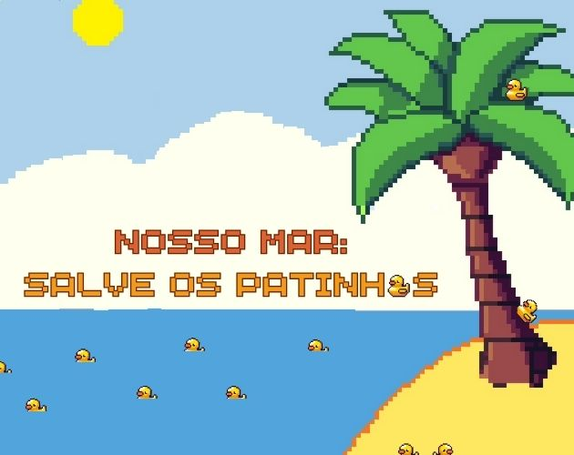

# Nosso Mar : Salve os Patinhos 🦆

## Integrantes do projeto:

| Nome                           | RA |
|--------------------------------|----|
| Ana Carolina Rodrigues Severino |2224201158|
| Carolina de Andrade Franzolin   |2224105045|
| Gabriel Matos Alencar           |2223106521|
| Geovanna Vieira dos Santos      |2222204887|
| Guilherme Augusto Schmidt Pereira|423104395|
| Guilherme Fortunato             |2224106521|
| João Pedro Miguez               |2224103481|
| Luis Eduardo Pedro              |2223203182|     		 |
| Lucas Oliveira Campos           |2223104810|
| Oliver Christian Souza Santos   |2223202759|
| Sheila Luiza Soares Cabral      |2224107373|
| Yago Raiol da Silva             |2224103545|

## 📽️ Videos
Video de Apresentação : https://youtu.be/-xPHrMiSaT4  
Video de Gameplay : https://www.youtube.com/watch?v=fDyu3GRaqsY

## 🌍 Inspiração do Jogo
Este jogo foi inspirado em um evento real onde ocorrido em 1992, quando um navio cargueiro derrubou um container com 28.000 patinhos de borracha no Oceano Pacífico.
Esses patinhos foram levados pelas correntes oceânicas, aparecendo em praias de diversos países e chamando a atenção para os efeitos da poluição nos oceanos e para a circulação de resíduos em escala global.

## 📖 Descrição do Jogo
<i><b>Nosso Mar: </i> <i>Salve os Patinhos</i> é um jogo educativo para conscientizar sobre os impactos da poluição.</b>
<b>No jogo, o jogador assume o papel de um protetor dos oceanos e precisa localizar e resgatar 20 patinhos de borracha espalhados pela praia, enfrentando desafios e aprendendo sobre questões ambientais ao longo do caminho.</b>

## 🏫 Cliente: Colégio Emílio de Rousseau
O cliente desse projeto é a escola Colégio Emílio de Rousseau, que utiliza o jogo <i>Nosso Mar: Salve os Patinhos</i> como uma ferramenta educativa para conscientizar os alunos sobre a importância de preservar os oceanos e combater a poluição.
Este projeto foi desenvolvido com com intuito de oferecer um recurso didático interativo.

## 🛠 Ferramentas Utilizadas
- *Unity*: Motor de jogo usado para o desenvolvimento e design de cenas interativas e objetos 2D.
-  *C#*: Linguagem de programação usada para a lógica do jogo, como movimentos, interações e criação de eventos.
- *GitHub*:  Plataforma de versionamento de código e colaboração em equipe, permitindo que os desenvolvedores compartilhem e sincronizem atualizações no código.
- *PixelArt*: Site utilizado para criar o GameArt do jogo.

### Sites Utilizados para Efeitos Sonoros e Música
- [CDN.pixabay.com](CDN.pixabay.com)
- [Assets.mixkit.com](Assets.mixkit.com)
- [fesliyanstudios.com](fesliyanstudios.com)
- [uppbeat.io](uppbeat.io)

## 🧑‍💻 Como Instalar e Rodar o Jogo

1. Antes de clonar o repositório você deve instalar a Unity. Acesse o [site oficial da Unity](https://unity.com/) para baixar a versão mais recente do motor de jogo.
 
2. Clonar o repositório 
Clone o repositório do projeto para sua máquina local: 
bash
git clone https://github.com/CC-SI/NossoMarTheOriginalGame.git

3. Abrir na Unity
- Na Unity, após o projeto ser carregado, clique em *Play* no topo da interface para iniciar o jogo dentro do editor.

## 📃Licença utilizada no projeto
Apache-2.0 license
